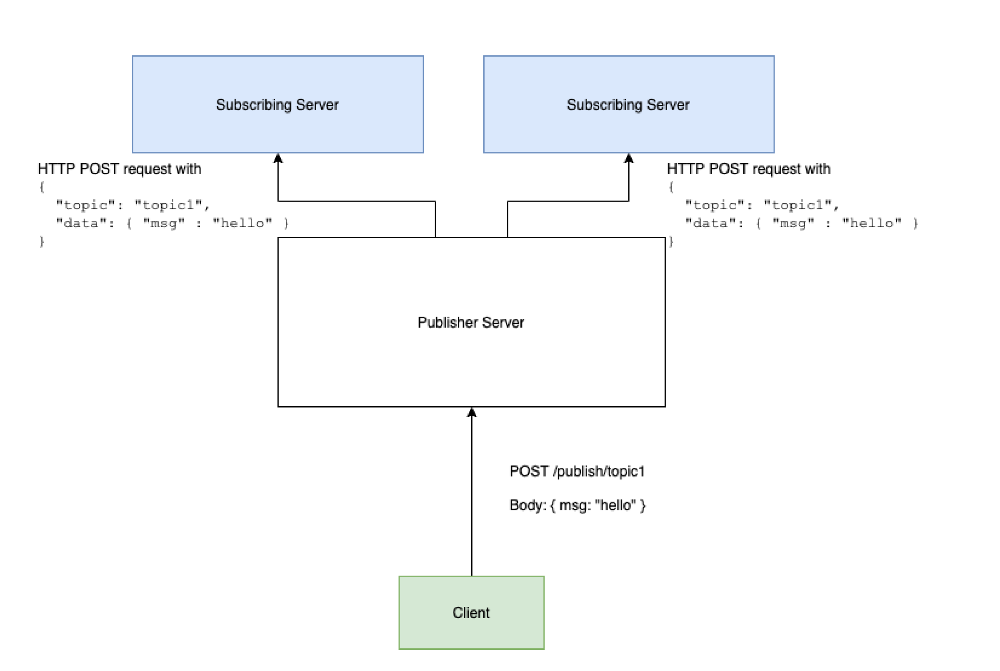

# Pangaea Take Home Assignment

For this challenge we'll be creating an HTTP notification system. A server (or set of servers) will keep track of topics and its
subscribers where a topic is a string, and a subscriber is an HTTP endpoint. When a message is published on a topic, it
should be forwarded to all subscriber endpoints.

Here's an image of a what we are trying to build:

## About Project

This project is built on [Lumen](https://lumen.laravel.com/) and utilizes some libraries and packages which can be found in the `composer.json` file.

## Setup

To set up the project,
-   Clone the repository from source control.
-   Navigate to the cloned repo on your computer using the CLI and do the following
    -   Install composer packages using `composer install`.
    -   Copy example env file to env `cp .env.example .env`.
    -   Generate application key using `php artisan key:generate`.
    -   Create a database in MySQL and enter its credentials in the `.env` file.
    -   Migrate and seed the database using `php artisan migrate:refresh --seed`. This will create sample topics and subscribers.
    -   Start Php's inbuilt server using `php artisan serve`.
    
## Endpoints
- POST `/subscribe/{topic}`. This route creates a subscriber for a topic. The `{topic}` route parameter should be the slug of any topic seeded into the database.
- POST `/publish/{topic}`. This route sends an HTTP request to all subscribers of a topic. The `{topic}` route parameter should be the slug of any topic seeded into the database. ***Please note that the HTTP request would not be sent if the topic does not have subscribers.***

## Tests
- Run application tests using `vendor/bin/phpunit`.
